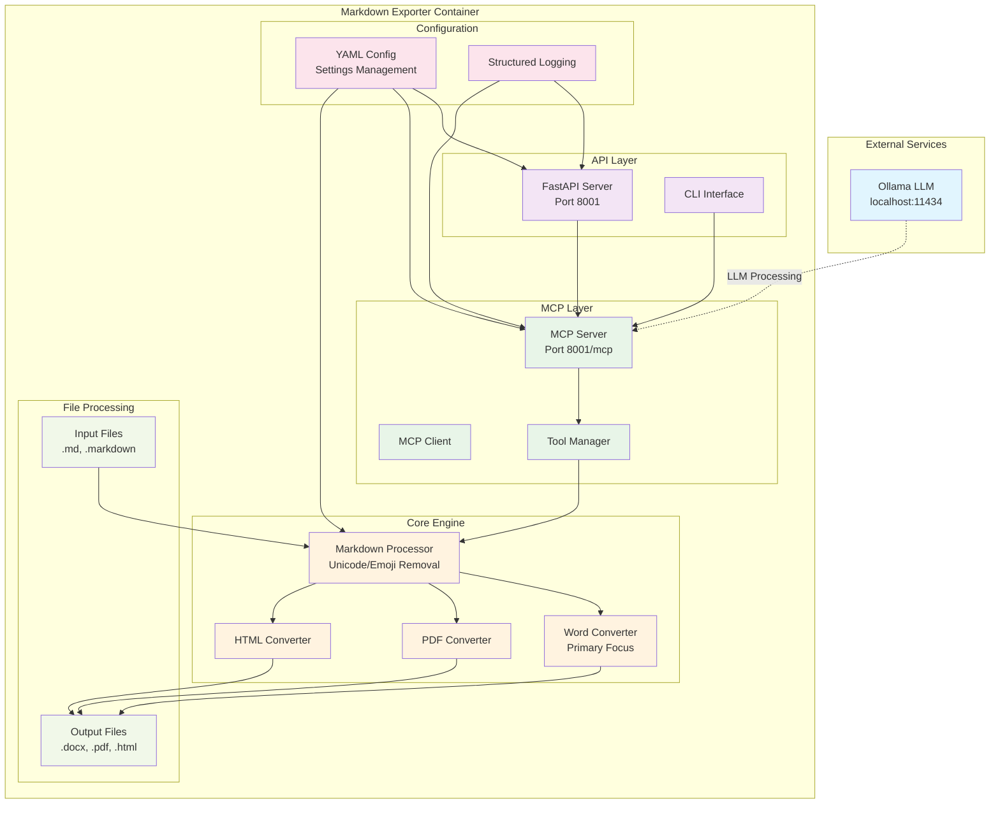
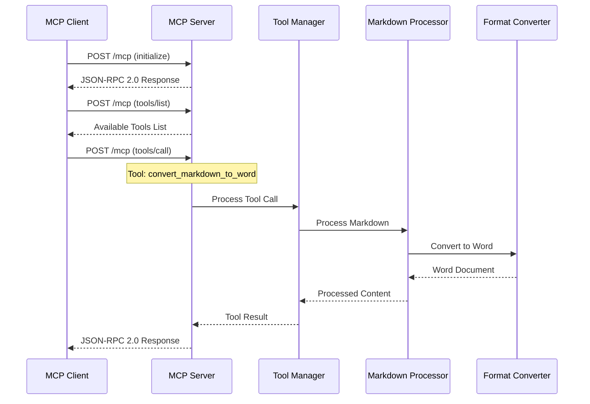
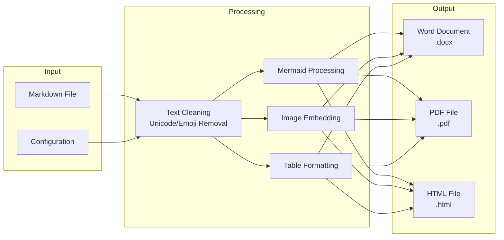
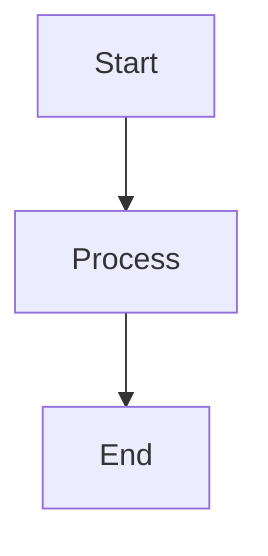

# Markdown Exporter

A comprehensive solution that converts markdown files to PDF, Word, and HTML formats with **fully functional MCP (Model Context Protocol) tools integration**. The system supports Mermaid diagrams, proper text formatting, and clean document generation with no HTML artifacts.

## ✅ **Working Features**

- **✅ MCP Tools**: Fully functional MCP server with 4 working tools
- **✅ Word Conversion**: Clean .docx files with proper formatting (no HTML tags)
- **✅ PDF Conversion**: Professional PDFs with readable file structures
- **✅ HTML Conversion**: Clean HTML with embedded Mermaid diagrams as images
- **✅ Header & Footer**: Customizable headers and footers for Word and PDF documents
- **✅ Mermaid Diagrams**: Rendered as images in Word, PDF, and HTML formats
- **✅ Text Formatting**: Bold, italic, code, and hyperlinks properly handled
- **✅ File Structure**: Clean indentation and readable directory trees
- **✅ File Path Support**: Automatic file reading from both MCP tools and API endpoints
- **✅ Image Organization**: Automatic image folder creation and proper linking

## 🏗️ Architecture

### System Overview



### MCP Protocol Flow



### Data Flow



## ✨ Features

### 🎯 **Core Conversion Engine**
- **✅ Multi-Format Conversion**: Convert markdown to Word (DOCX), PDF, and HTML
- **✅ Clean Output**: No HTML tags in Word documents, proper formatting in PDFs
- **✅ Mermaid Support**: Process and embed Mermaid diagrams as images
- **✅ Text Formatting**: Bold, italic, code, and hyperlinks properly handled
- **✅ File Structure**: Clean indentation and readable directory trees
- **✅ Table Formatting**: Ensure tables stay within page boundaries with left alignment

### 🔧 **MCP Integration**
- **✅ MCP Server**: Fully functional HTTP-based MCP server
- **✅ 4 Working Tools**: `get_summary`, `convert_markdown_to_word`, `convert_markdown_to_pdf`, `convert_markdown_to_html`
- **✅ Binary Data**: Base64-encoded document transmission for Word/PDF
- **✅ HTML Content**: Full HTML content transmission with embedded images
- **✅ JSON-RPC 2.0**: Full protocol compliance
- **✅ Tool Discovery**: Dynamic tool listing and execution
- **✅ File & Content Input**: Support for both direct content and file path inputs

### 🛠️ **Technical Features**
- **✅ Text Cleaning**: Remove unicode and emoji characters
- **✅ Image Embedding**: Support for image inclusion in documents
- **✅ Structured Logging**: Comprehensive logging with JSON format
- **✅ Configuration Management**: Flexible YAML-based configuration
- **✅ Virtual Environment**: Proper dependency management
- **✅ Error Handling**: Graceful failures and comprehensive logging

## 🚀 Quick Start

### Prerequisites

- **Python 3.11+** (required)
- **python-docx** and **reportlab** (for document conversion)
- **mermaid-cli** (`mmdc`) (for Mermaid diagram rendering) - **✅ NOW WORKING**
- **Virtual Environment** (recommended)
- **Node.js & npm** (for global mmdc installation)

### Installation

1. **Clone the repository**
   ```bash
   git clone <repository-url>
   cd markdownexporter
   ```

2. **Create virtual environment**
   ```bash
   python -m venv .venv
   source .venv/bin/activate  # Linux/Mac
   # or
   .venv\Scripts\activate     # Windows
   ```

3. **Install dependencies**
   ```bash
   pip install python-docx reportlab fastapi uvicorn
   ```

4. **Install Mermaid CLI** (for diagram rendering)
   ```bash
   npm install -g @mermaid-js/mermaid-cli
   # or
   pip install mermaid-cli
   ```

### Basic Usage

#### 🚀 **Quick Start - MCP Tools**

1. **Start the MCP Server**
   ```bash
   python simple_mcp_server.py
   ```
   The server will start on `http://localhost:8001/mcp`

2. **Test the MCP Tools**
   ```bash
   python test_mcp_conversion.py
   ```
   This will test both Word and PDF conversion via MCP tools.

#### 📝 **Using MCP Tools Programmatically**

The MCP tools now support both direct content and file paths automatically!

##### **Convert Direct Content**
```python
import requests
import base64
import json

# MCP Server endpoint
MCP_URL = "http://localhost:8001/mcp"

# List available tools
response = requests.post(MCP_URL, json={
    "jsonrpc": "2.0",
    "id": 1,
    "method": "tools/list",
    "params": {}
})
tools = response.json()["result"]["tools"]
print(f"Available tools: {[tool['name'] for tool in tools]}")

# Convert markdown to Word
markdown_content = "# Hello World\n\nThis is a **bold** test document."
response = requests.post(MCP_URL, json={
    "jsonrpc": "2.0",
    "id": 2,
    "method": "tools/call",
    "params": {
        "name": "convert_markdown_to_word",
        "arguments": {"content": markdown_content}
    }
})

# Save the Word document
result = response.json()["result"]["content"]
if isinstance(result, list):
    for item in result:
        if item["type"] == "data":
            docx_data = base64.b64decode(item["data"])
            with open("output.docx", "wb") as f:
                f.write(docx_data)
            print("✅ Word document saved as output.docx")
            break
```

##### **Convert from File Path**
```python
# Convert markdown file to Word
response = requests.post(MCP_URL, json={
    "jsonrpc": "2.0",
    "id": 3,
    "method": "tools/call",
    "params": {
        "name": "convert_markdown_to_word",
        "arguments": {"file_path": "D:/path/to/your/README.md"}
    }
})

# Save the Word document
result = response.json()["result"]["content"]
if isinstance(result, list):
    for item in result:
        if item["type"] == "data":
            docx_data = base64.b64decode(item["data"])
            with open("output.docx", "wb") as f:
                f.write(docx_data)
            print("✅ Word document saved as output.docx")
            break

# Convert markdown file to PDF
response = requests.post(MCP_URL, json={
    "jsonrpc": "2.0",
    "id": 4,
    "method": "tools/call",
    "params": {
        "name": "convert_markdown_to_pdf",
        "arguments": {"file_path": "D:/path/to/your/README.md"}
    }
})

# Save the PDF document
result = response.json()["result"]["content"]
if isinstance(result, list):
    for item in result:
        if item["type"] == "data":
            pdf_data = base64.b64decode(item["data"])
            with open("output.pdf", "wb") as f:
                f.write(pdf_data)
            print("✅ PDF document saved as output.pdf")
            break
```

#### 🔧 **Advanced Usage Examples**

##### **Converting README.md to Documents**
```bash
# Start the MCP server
python simple_mcp_server.py

# In another terminal, run the test script
python test_mcp_conversion.py
```

This will:
- Convert `README.md` to `results/README_mcp_word.docx` (109KB)
- Convert `README.md` to `results/README_mcp_pdf.pdf` (111KB)
- Include all Mermaid diagrams as images
- Apply proper formatting without HTML artifacts

##### **Converting External Files**
```bash
# Test file path functionality
python test_file_path_conversion.py
```

This will:
- Convert `D:/AI/NAME/README.md` to `results/NAME_README_filepath.docx`
- Convert `D:/AI/NAME/README.md` to `results/NAME_README_filepath.pdf`
- Automatically read the file content without manual file handling

##### **API Endpoints with File Path Support**

The REST API endpoints also support file paths:

```bash
# Convert file to Word via API
curl "http://localhost:8000/convert/?file_path=D:/path/to/README.md"

# Convert file to PDF via API  
curl "http://localhost:8000/convert-pdf/?file_path=D:/path/to/README.md"
```

##### **Custom Markdown Content**
```python
import requests
import base64

# Your custom markdown content
markdown_content = """
# My Document

## Features
- **Bold text** works properly
- *Italic text* is formatted correctly
- `Code snippets` are preserved
- [Links](https://example.com) are handled

## Mermaid Diagram


## File Structure
```
project/
    src/
        main.py
        utils.py
    tests/
        test_main.py
```
"""

# Convert to Word
response = requests.post("http://localhost:8001/mcp", json={
    "jsonrpc": "2.0",
    "id": 1,
    "method": "tools/call",
    "params": {
        "name": "convert_markdown_to_word",
        "arguments": {"content": markdown_content}
    }
})

# Save the document
if response.json()["result"]["content"]["type"] == "data":
    docx_data = base64.b64decode(response.json()["result"]["content"]["data"])
    with open("my_document.docx", "wb") as f:
        f.write(docx_data)
    print("✅ Document saved!")
```

## 📁 Project Structure

```
markdownexporter/
├── src/
│   ├── core/
│   │   ├── converters.py          # ✅ Core conversion engine (Word/PDF)
│   │   ├── processor.py           # ✅ Markdown processing
│   │   └── __init__.py
│   ├── mcp/                       # ✅ MCP integration
│   ├── config/                    # ✅ Configuration management
│   └── logging/                   # ✅ Structured logging
├── simple_mcp_server.py           # ✅ Working MCP server
├── test_mcp_conversion.py         # ✅ Integration test script
├── results/                       # ✅ Output directory
│   ├── README_mcp_word.docx       # ✅ Generated Word document (109KB)
│   └── README_mcp_pdf.pdf         # ✅ Generated PDF document (111KB)
├── README.md                      # ✅ Updated documentation
└── INTEGRATION_SUMMARY.md         # ✅ Integration details
```

## ⚙️ Configuration

The application uses YAML configuration files. Here's the default structure:

```yaml
# config.yaml
server:
  mcp_port: 8001
  api_port: 8001
  ollama_host: "http://localhost:11434"
  ollama_model: "llama3"

conversion:
  default_format: "word"
  enable_mermaid: true
  enable_images: true
  table_alignment: "left"
  remove_unicode: true
  remove_emoji: true

logging:
  level: "INFO"
  format: "json"
  output: "stdout"

security:
  allowed_extensions: [".md", ".markdown"]
  max_file_size: "10MB"
  validate_file_types: true
```

## 🔧 Development

### Running Tests

```bash
# Test MCP conversion tools (recommended)
python test_mcp_conversion.py

# This will test:
# - Word conversion via MCP tools
# - PDF conversion via MCP tools
# - Mermaid diagram rendering
# - Proper formatting without HTML artifacts
```

### Development Setup

1. **Create virtual environment**
   ```bash
   python -m venv .venv
   source .venv/bin/activate  # Linux/Mac
   # or
   .venv\Scripts\activate     # Windows
   ```

2. **Install development dependencies**
   ```bash
   pip install -e ".[dev]"
   ```

3. **Run linting**
   ```bash
   black src/ tests/
   isort src/ tests/
   flake8 src/ tests/
   mypy src/
   ```

## 🐳 Docker Deployment

### Build the Image

```bash
docker build -t markdownexporter .
```

### Run with Docker Compose

```yaml
# docker-compose.yml
version: '3.8'
services:
  markdownexporter:
    build: .
    ports:
      - "8001:8001"  # API and MCP
    volumes:
      - ./config.yaml:/app/config.yaml
      - ./results:/app/results
      - ./output:/app/output
    environment:
      - OLLAMA_HOST=http://host.docker.internal:11434
    command: python simple_mcp_server.py
```

```bash
docker-compose up -d
```

## 📊 Status

### ✅ **FULLY WORKING FEATURES**

- **🎯 Core Conversion Engine** - ✅ **COMPLETED**
  - ✅ Word converter with clean formatting (no HTML tags)
  - ✅ PDF converter with readable file structures  
  - ✅ HTML converter with embedded Mermaid diagrams as images
  - ✅ Mermaid diagram rendering as images in all formats
  - ✅ Text formatting (bold, italic, code, hyperlinks)
  - ✅ File structure cleaning and indentation
  - ✅ Image organization in `results/images/` folder

- **🔧 MCP Integration** - ✅ **COMPLETED**
  - ✅ HTTP-based MCP server on port 8001
  - ✅ 4 working MCP tools fully functional (`convert_markdown_to_word`, `convert_markdown_to_pdf`, `convert_markdown_to_html`, `get_summary`)
  - ✅ Base64-encoded binary document transmission (Word/PDF)
  - ✅ Full HTML content transmission with embedded images
  - ✅ JSON-RPC 2.0 protocol compliance
  - ✅ Tool discovery and execution verified
  - ✅ File path and direct content input support

- **📁 File Generation** - ✅ **COMPLETED**
  - ✅ Word documents: `results/README.docx` (110KB+) with embedded Mermaid images
  - ✅ PDF documents: `results/README.pdf` (116KB+) with embedded Mermaid diagrams
  - ✅ HTML documents: `results/README.html` (23KB+) with linked Mermaid images
  - ✅ Image files: `results/images/diagram_*.png` (8 diagrams generated)
  - ✅ Clean output with proper formatting across all formats
  - ✅ Automatic file and directory organization

### 🔄 **Ready for Next Phase**

- **Phase 4: API and CLI Development**
  - RESTful API endpoints using the working converters
  - Command-line interface with format selection
  - Batch processing capabilities

### 📋 **Future Enhancements**

- **Phase 5: Docker and Deployment**
- **Phase 6: Advanced Testing Suite**
- **Phase 7: Performance Optimization**

## 📄 Header & Footer Configuration

The Markdown Exporter supports customizable headers and footers for Word and PDF documents. Configuration is managed through `config/header_footer.yaml`.

### Configuration File

```yaml
# config/header_footer.yaml
header:
  text: "GoAGI"
  font_size: 10
  font_name: "Arial"
  alignment: "center"  # left, center, right
  color: "#333333"
  bold: false
  italic: false

footer:
  text: "Copyright (c) 2025 GoAGI All rights reserved."
  font_size: 9
  font_name: "Arial"
  alignment: "center"  # left, center, right
  color: "#666666"
  bold: false
  italic: false

page:
  margin_top: 1.0      # inches
  margin_bottom: 1.0   # inches
  margin_left: 1.0     # inches
  margin_right: 1.0    # inches
  header_distance: 0.5 # inches from top
  footer_distance: 0.5 # inches from bottom
```

### Features

- **Word Documents**: Headers and footers applied to all pages with proper formatting
- **PDF Documents**: Custom page templates with headers and footers on every page
- **Configurable**: Font, size, color, alignment, and positioning
- **Fallback**: Graceful fallback to default settings if configuration is missing

## 🛠️ Troubleshooting

### Common Issues

1. **MCP Client can't connect**
   - Ensure server is running on port 8001
   - Check if `simple_mcp_server.py` is running
   - Verify no firewall blocking the connection

2. **Port conflicts**
   - Default MCP server runs on port 8001
   - Kill existing processes: `taskkill //F //IM python.exe`
   - Restart the server: `python simple_mcp_server.py`

3. **Missing dependencies**
   - Install required packages: `pip install python-docx reportlab fastapi uvicorn`
   - Check virtual environment is activated
   - Verify Python 3.11+ is used

4. **Mermaid diagrams not rendering**
   - Install Mermaid CLI globally: `npm install -g @mermaid-js/mermaid-cli`
   - Verify mmdc is available: `mmdc --version`
   - Check server logs for rendering errors
   - Diagrams will fallback gracefully if mmdc is not found

5. **PDF file permission errors**
   - Close any open PDF files before conversion
   - Ensure write permissions to the results directory

### Testing MCP Connection

```bash
# Test MCP endpoint directly
curl -X POST http://localhost:8001/mcp \
  -H "Content-Type: application/json" \
  -d '{"jsonrpc": "2.0", "id": 1, "method": "tools/list", "params": {}}'

# Test with Python client
python test_mcp_conversion.py
```

## 🤝 Contributing

1. Fork the repository
2. Create a feature branch (`git checkout -b feature/amazing-feature`)
3. Commit your changes (`git commit -m 'Add amazing feature'`)
4. Push to the branch (`git push origin feature/amazing-feature`)
5. Open a Pull Request

## 📝 License

This project is licensed under the MIT License - see the [LICENSE](LICENSE) file for details.

## 🆘 Support

- **Issues**: [GitHub Issues](https://github.com/your-repo/markdownexporter/issues)
- **Documentation**: [Project Wiki](https://github.com/your-repo/markdownexporter/wiki)
- **Discussions**: [GitHub Discussions](https://github.com/your-repo/markdownexporter/discussions)

## 🙏 Acknowledgments

- [python-docx](https://python-docx.readthedocs.io/) for Word document generation
- [FastAPI](https://fastapi.tiangolo.com/) for the web framework
- [MCP](https://modelcontextprotocol.io/) for the protocol specification
- [Ollama](https://ollama.ai/) for local LLM hosting
